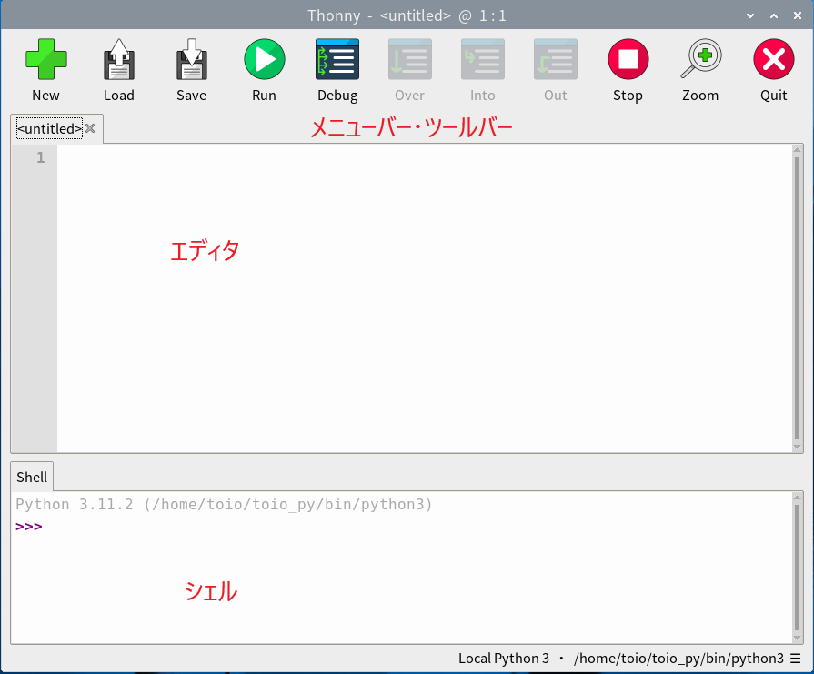

# 1. Thonnyエディタの使い方

Raspberry Pi上のThonnyエディタを使ってプログラムを書きます．

*画像出典: https://thonny.org/*


## Thonnyの起動方法

1. **デスクトップから起動**
   
   - デスクトップのラズベリーパイアイコン -> プログラミング -> Thonny の順番にクリック

2. **ターミナルから起動**
   
   ```bash
   thonny
   ```

## Thonnyの画面構成

Thonnyの画面は主に以下の3つの部分に分かれています：



1. **エディタ（上部）**
   
   - プログラムコードを書く場所
   - 複数のファイルをタブで切り替え可能
   - 行番号が表示される
   - 構文エラーは赤い下線で表示される

2. **シェル（下部）**
   
   - プログラムの実行結果が表示される場所
   - エラーメッセージもここに表示される
   - 直接Pythonコマンドを入力することも可能

3. **メニューバー・ツールバー**
   
   - ファイルの保存・読み込み
   - プログラムの実行・停止
   - デバッグ機能

## 基本的な操作方法

##### 1. 新しいファイルを作成

- **New** または `Ctrl + N`

##### 2. ファイルを保存

- **Save** または `Ctrl + S`
- 初回保存時はファイル名を入力（例：`my_program.py`）
- ファイル名は英数字で，スペースは使わない

##### 3. プログラムを実行

- **緑の三角ボタン（▶）Run** をクリック または `F5`
- プログラムが保存されていない場合、自動的に保存される
- 実行結果はシェル画面に表示される

##### 4. プログラムを停止

- **赤い四角ボタン（■）Stop** をクリック または `Ctrl + C`

##### 5. エディタでのコピー&ペースト

- コピー: `Ctrl + C`

- ペースト: `Ctrl + V`
