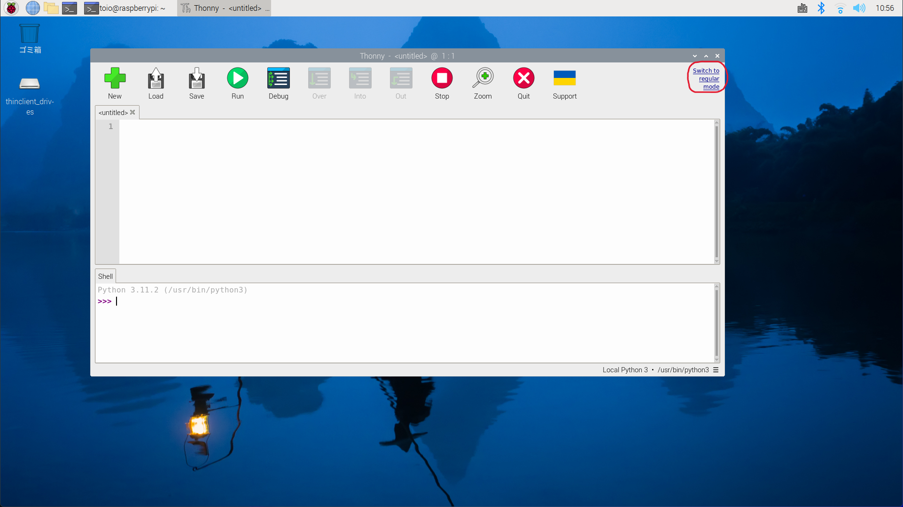
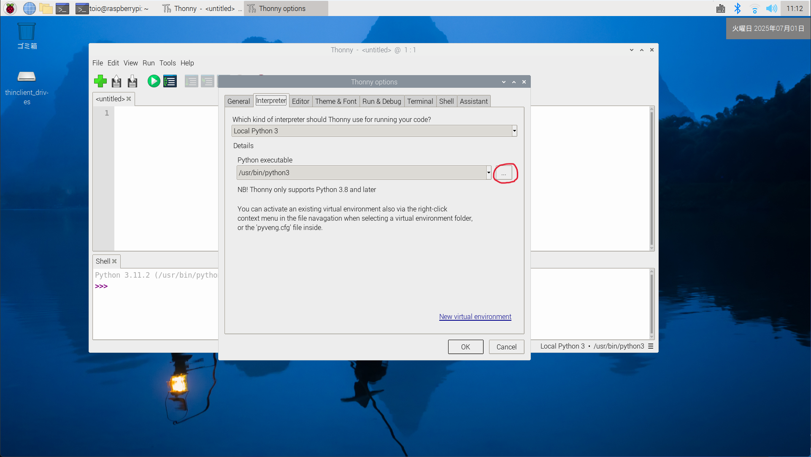
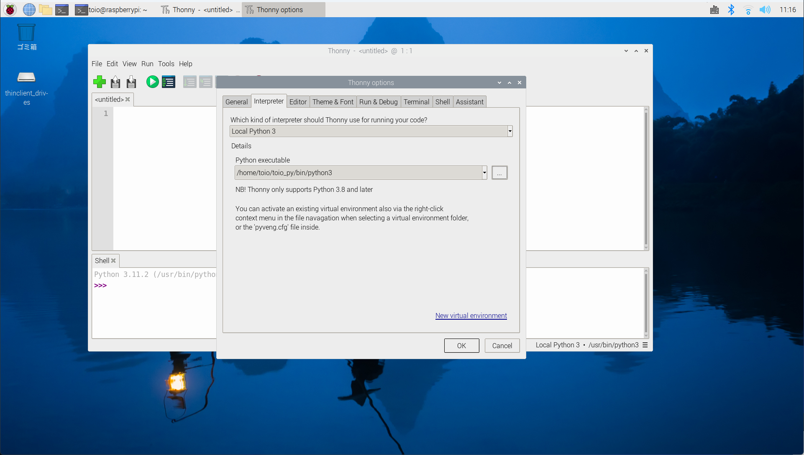

## toio.pyのセットアップ

LXTerminalを開いて，Pythonのバージョンが3.8以降であることを確認する（公式の推奨は3.12）

```shell
python --version
```

仮想環境を作成する

```shell
python -m venv ~/toio_py
```

仮想環境を有効化する

```shell
source ~/toio_py/bin/activate
```

すると，プロンプトの先頭に `(toio_py)` のように表示されます．これは仮想環境が有効になっていることを示します．

仮想環境が有効な状態で次のコマンドを実行します：

```shell
python -m pip install setuptools --upgrade
python -m pip install typing-extensions
python -m pip install bleak==0.22.3
python -m pip install toio-py --upgrade
python -m pip install ipykernel
```

※ 2025年7月1日時点のbleakの最新バージョン（1.0.1）では，SimpleCubeの切断がうまくいかない．バージョン（0.22.3）を使う．

確認

```shell
python -c "import toio.scanner; print('ok')"
```

`ok` と表示が出れば toio.py のインストールは成功です．

## Thonnyの設定

起動

1. 左上の Raspberry メニュー（ラズベリーマーク） をクリック

2. Programming（プログラミング） を選択

3. Thonnyをクリック

Thonnyが立ち上がる，regular modeになっていない場合は右上の'Switch to regular mode'をクリックする．

OKをクリックして，一度Thonnyを終了して，もう一度起動する．



簡易モードに戻す方法は

Tools -> Options -> General -> UI mode -> simple

インタープリタの設定

- メニューバーから  
  `Tools（ツール）` → `Options（オプション）`

- 上部タブで `Interpreter（インタープリタ）` を選択

- Python executableの...をクリック
  
  - 

- 環境を構築したフォルダを選択する

- ホーム -> toio_py -> bin -> python3

- OKをクリック
  
  - 

Thonny のShell画面に

```python
import toio.scanner; print('ok')
```

と入力し`ok`と表示が出れば設定は完了．

## 日本語入力の有効化

### Raspberry Pi に日本語入力を導入する

**パッケージをインストール（Fcitx + Mozc）**

```shell
sudo apt update
sudo apt install -y fcitx-mozc fonts-ipafont
```

- `fcitx-mozc`：日本語入力システム（MozcはGoogle日本語入力のOSS版）

- `fonts-ipafont`：日本語フォント（IPA）

再起動する

```shell
sudo reboot
```

再起動後，タスクバー右上に Fcitx のアイコンが出ているか確認（四角いキーボードのようなマーク）  

**入力切り替えキー**

- 通常は **Ctrl + Space** または **半角/全角キー（キーボードにある場合）** で切り替え

- 反応しない場合は Fcitx 設定でショートカットを確認・変更可能

---

必要ならばフォントのインストール

```shell
sudo apt install fonts-noto-cjk
```

でインストールする．システムのフォントにするには「Raspberry Pi アイコン -> Preferences（設定） -> Appearance settings（外観の設定） -> System（システム） -> Font（フォント）」で Noto フォントを選ぶ．

`Noto Sans CJK HK Regular`

---

## キューブIDを指定して接続する方法

```python
from toio.simple import SimpleCube
target_cube_name = "toio-xxx" #実際のキューブ名に変更

with SimpleCube(name=target_cube_name) as cube:
    #キューブを操作
    cube.move(30, 1) # 前進
```
